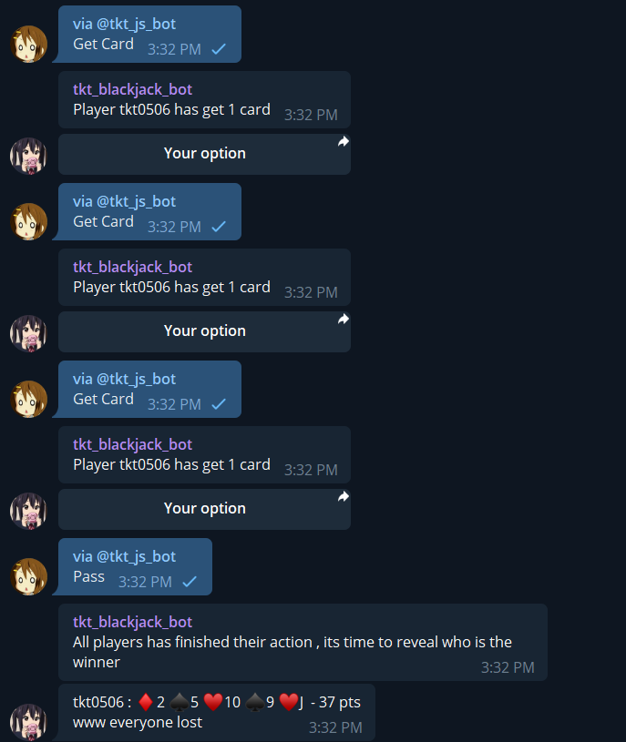

# blackjack_Bot #

## Play blackjack/21 points at telegram ! ##

 

[bot invite link](https://t.me/tkt_js_bot)

## set up ##
1. ```pip install -r requirements.txt```
2. ```python main.py```

## how to use the bot ##
1. Use /open_21 to open a room
2. Use /start_21 to start a game 
3. Get card / pass by using inline
4. End the game by using /end_21
5. Close the room by using /close_21

## Command available: ##
- /help - show this message  
- /open_21 - open a room 
- /join_21 - join a room 
- /kick_21 <name> - kick player in room 
- /start_21 - start a game (bot : bot pick , ran : random select) 
- /end_21 - end a game  
- /leave_21 - leave a room 
- /close_21 - close a room 
- /stats_21 - show player stats 
- /board_21 <num> - show leaderboard 

## Credit ##
- [rain2wood](https://github.com/rain2wood) for giving suggestion and inspiration
- [CCN0807](https://github.com/CCN0807) for giving suggestion and inspiration
- [telebot](https://github.com/eternnoir) for using the api service
- [pymongo](https://github.com/mongodb) for accessing the mongodb


Yay finally finish the code 

